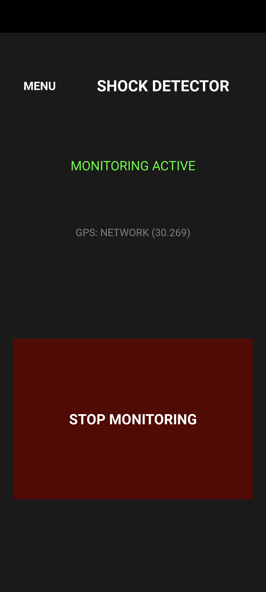
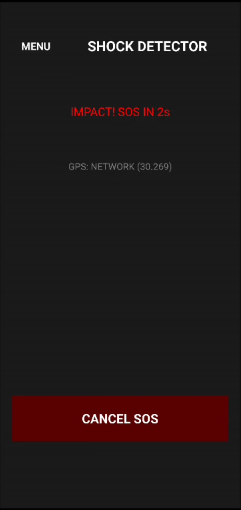
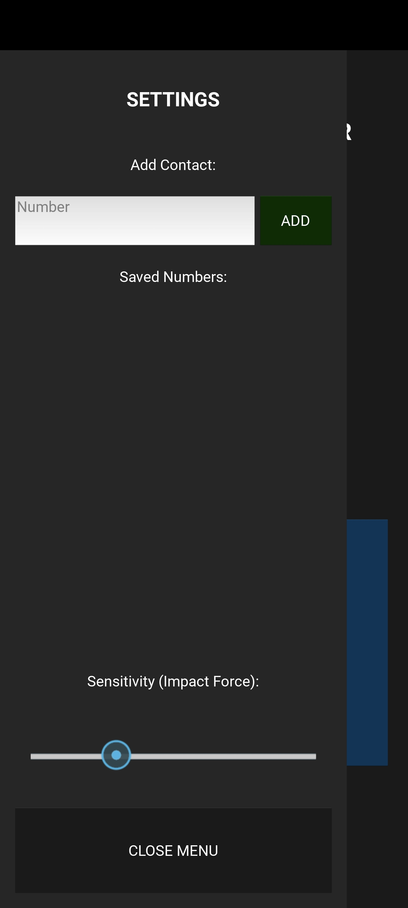
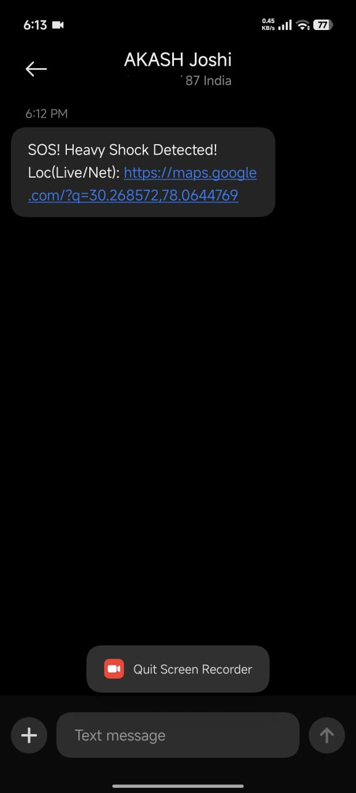

<div align="center">

# 🚨 Emergency Shock Detector

**A Python-powered Android application that turns any smartphone into a passive impact-detection safety device — automatically dispatching emergency calls and SMS alerts when a sudden, high-magnitude shock is detected.**

[](https://www.python.org/)
[](https://kivy.org/)
[](https://developer.android.com/)
[](LICENSE)

📲 **Pre-compiled APK binaries are available directly in the [`/app`](app/) folder — no build step required to try it out.**

</div>

---

## 📖 Overview

**Emergency Shock Detector** is a lightweight, always-on Android safety application built entirely in Python using **Kivy** for the UI toolkit and **Plyer** for native hardware access. It continuously monitors the device's accelerometer in the background and applies a physics-based impact model to distinguish a genuine high-magnitude shock (a fall, a crash, a blow) from ordinary handling motion.

When a qualifying impact is detected, the app enters a high-visibility alert state with a non-blocking countdown, giving the user a window to cancel a false positive before the app automatically places an emergency call and sends an SOS text to pre-configured contacts.

The entire application — UI, sensor polling, state machine, and native Android integrations — is written in Python, making it a practical reference implementation for **Kivy + Plyer + Buildozer** cross-compiled Android apps.

---

## 🏗️ Technical Architecture & Engineering Details

### 🔄 State Machine & Lifecycle

The application is built around a **state-driven UI architecture** defined in `main.py`, where the entire visual theme and interaction model of the app is a function of a single current state. This keeps rendering logic predictable and makes the countdown/alert flow trivial to reason about.

| State | Theme | Behavior |
|---|---|---|
| 🟢 `MONITORING_ACTIVE` | Green | Default resting state. Accelerometer is polled continuously at 30 Hz, UI reflects a calm "protected" status. |
| 🔴 `IMPACT_ALERT` | Red (high contrast) | Triggered the instant a shock magnitude exceeds threshold. Displays a **non-blocking countdown timer** allowing the user to cancel before emergency actions fire. |
| ⚪ `MONITORING_STOPPED` | Gray | Manually paused by the user. Sensor polling is suspended; no impact detection occurs until monitoring is resumed. |

The countdown in `IMPACT_ALERT` is implemented as a **non-blocking** Kivy `Clock.schedule_interval` callback rather than a blocking `sleep()` loop — this keeps the UI thread fully responsive so the "Cancel" button remains tappable for the entire duration of the countdown, which is critical for avoiding false-positive emergency dispatches.

```
        ┌─────────────────────┐
        │  MONITORING_ACTIVE   │◄──────────────┐
        │  (Green)             │                │
        └──────────┬───────────┘                │
                    │ magnitude > threshold      │ user cancels
                    ▼                            │ / countdown resets
        ┌─────────────────────┐                  │
        │   IMPACT_ALERT       │──────────────────┘
        │   (Red + Countdown)  │
        └──────────┬───────────┘
                    │ countdown reaches 0
                    ▼
        ┌─────────────────────┐
        │  SOS Dispatch         │
        │  (Call + SMS fired)   │
        └─────────────────────┘

        ┌─────────────────────┐
        │  MONITORING_STOPPED  │
        │  (Gray)               │  ◄── manually toggled from any state
        └─────────────────────┘
```

### 📡 Hardware Interfacing — Sensory Polling

Raw motion data is sourced through **Plyer's** cross-platform `accelerometer` facade, which under the hood binds to Android's native `SensorManager` API via `PyJNIus`. The application:

- Enables the accelerometer sensor on app start (`accelerometer.enable()`)
- Polls raw 3-axis values (`x`, `y`, `z`) at a fixed cadence of **30 Hz**, scheduled via `Clock.schedule_interval(poll_sensor, 1/30)`
- Runs this polling loop only while in the `MONITORING_ACTIVE` state, conserving battery when monitoring is stopped

30 Hz was chosen as a balance point — fast enough to reliably capture the sharp transient signature of a real impact event, without over-polling and needlessly draining battery on a background always-on service.

### 🧮 Impact Mathematics

Each accelerometer sample is reduced to a single scalar **vector magnitude**, combining all three spatial axes into one impact intensity value:

$$\text{Magnitude} = \sqrt{x^2 + y^2 + z^2}$$

```python
import math

def compute_magnitude(x, y, z):
    return math.sqrt(x**2 + y**2 + z**2)
```

This magnitude is evaluated on every sample against a **dynamic threshold** value — dynamic in the sense that it is not hardcoded, but read live from the user's persisted sensitivity setting (see [Storage & Persistence](#-storage--persistence) below). When `magnitude > threshold`, the app transitions immediately from `MONITORING_ACTIVE` into `IMPACT_ALERT`.

Because normal handling and walking motion typically hovers close to Earth's gravitational constant (~9.8 m/s² baseline, plus modest noise), a well-calibrated threshold well above that baseline is what allows the app to distinguish a genuine shock (a fall, collision, or hard drop) from routine phone movement — while the adjustable slider (see Settings Drawer below) lets users tune this sensitivity to their own use case, device, and false-positive tolerance.

### 💾 Storage & Persistence

All user configuration — emergency contact numbers and the custom accelerometer sensitivity threshold — is persisted locally using Kivy's lightweight built-in **`JsonStore`**, backed by `shockdetector_storage.json` in the app's local storage directory.

```python
from kivy.storage.jsonstore import JsonStore

store = JsonStore('shockdetector_storage.json')

# Persisting settings
store.put('settings', threshold=25.0, contact='+91XXXXXXXXXX')

# Reading settings back on app launch
if store.exists('settings'):
    settings = store.get('settings')
```

This ensures that emergency contacts and sensitivity calibration **survive app restarts and device reboots** without requiring any external database, network sync, or additional dependencies — keeping the app fully offline-capable and privacy-respecting, since no personal data ever leaves the device.

### 🔌 Android Native Integrations

The app requests the following runtime permissions, declared in `buildozer.spec` and requested at runtime where required by modern Android permission models:

| Permission | Purpose |
|---|---|
| `CALL_PHONE` | Enables the app to programmatically place the emergency call once the countdown completes |
| `BODY_SENSORS` | Required for accelerometer access on Android versions enforcing sensor-category runtime permissions |
| `VIBRATE` | Drives haptic feedback during `IMPACT_ALERT` to make the countdown state unmistakable even if the phone is out of sight |
| `WAKE_LOCK` | Keeps the CPU active during monitoring so background sensor polling isn't suspended by Android's power-saving/Doze modes |

Native functionality is executed through two complementary layers:

- **`Plyer`** — used for the higher-level, cross-platform-safe operations: accelerometer access, vibration, and SMS composition/sending.
- **`PyJNIus`** — used where direct access to Android's native Java APIs is required, most notably for placing the emergency phone call via Android's `Intent.ACTION_CALL` (which requires `CALL_PHONE`) and any other tighter native intent handling that Plyer's abstraction doesn't cover.

This layered approach keeps the majority of the codebase portable and readable through Plyer's simple Python API, while still allowing precise native control at the specific points where Android's permission and intent system demands it.

---

## 🖼️ Visual Gallery

<div align="center">

<table>
  <tr>
    <td align="center" width="50%">
      
      <br/>
      <b>🟢 Normal Dashboard</b>
      <br/>
      <sub>Standard active monitoring state with calm green UI elements</sub>
    </td>
    <td align="center" width="50%">
      
      <br/>
      <b>🔴 Impact Detected</b>
      <br/>
      <sub>Emergency SOS countdown state with high-contrast red UI elements</sub>
    </td>
  </tr>
  <tr>
    <td align="center" width="50%">
      
      <br/>
      <b>⚙️ Settings Drawer</b>
      <br/>
      <sub>Slide-out menu for emergency contacts & sensitivity threshold tuning</sub>
    </td>
    <td align="center" width="50%">
      
      <br/>
      <b>📤 SMS / Call Dispatch</b>
      <br/>
      <sub>Automated emergency SMS/call actions firing on countdown completion</sub>
    </td>
  </tr>
</table>

</div>

---

## 🚀 Installation & Setup Guide

### 📥 Method 1: Direct APK Installation *(End Users)*

The fastest way to get the app running on a real device — no Python, Kivy, or build toolchain required.

1. Navigate to the [`/app`](app/) directory in this repository.
2. Download **`base.apk`**.
3. Transfer the file to an Android device (**Android 5.0 / API 21 or higher**).
4. Enable **Install from Unknown Sources** in your Android device settings.
5. Install the APK and launch **Shock Detector**.
6. Grant the initial **Call Phone** and **Body Sensors** permissions when prompted — these are required for the app's core safety functionality.

> ⚠️ This is a `-debug` build intended for evaluation and testing. For production/personal daily use, consider building a signed release APK via Method 2.

### 🛠️ Method 2: Building from Source *(Developers)*

For contributors and developers who want to modify, debug, or rebuild the app.

```bash
# 1. Clone the repository
git clone https://github.com/<your-username>/emergency-shock-detector.git
cd emergency-shock-detector

# 2. Create and activate a Python virtual environment
python -m venv venv
source venv/bin/activate      # On Windows: venv\Scripts\activate

# 3. Install dependencies
pip install kivy plyer

# 4. Run locally for rapid UI/logic debugging (desktop window, no APK build needed)
python main.py

# 5. Build the Android APK using Buildozer
buildozer android debug
```

The compiled APK will be output to the `bin/` directory after a successful Buildozer build. Note that step 4 (`python main.py`) runs the Kivy UI on your desktop for fast iteration — accelerometer input will need to be mocked or tested on-device/emulator since desktop environments don't expose a real accelerometer.

> 💡 **First-time Buildozer users:** the initial `buildozer android debug` run will download and configure the Android SDK/NDK toolchain, which can take a while. Subsequent builds are significantly faster.

---

## 🗂️ Repository File Structure

```text
├── app/
│   └── base.apk
├── screenshots/
│   ├── normal_dashboard.png
│   ├── shock_detected.png
│   ├── settings_drawer.png
│   └── sms_sent.png
├── .gitignore
├── README.md
├── buildozer.spec
├── icon.png
├── main.py
├── shockdetector.kv
└── shockdetector_storage.json
```

| Path | Description |
|---|---|
| `app/` | Pre-compiled Android APK binaries, ready for direct install |
| `screenshots/` | UI screenshots used in this README's visual gallery |
| `buildozer.spec` | Buildozer configuration — permissions, package metadata, target Android API/NDK |
| `icon.png` | Application launcher icon |
| `main.py` | Core application logic — state machine, sensor polling, impact math, native dispatch |
| `shockdetector.kv` | Kivy language file defining the UI layout and widget tree |
| `shockdetector_storage.json` | Runtime-generated `JsonStore` file persisting user settings (not committed with real user data) |

---

## ⚠️ Disclaimer

Emergency Shock Detector is provided as a supplementary safety tool and **is not a certified medical alert or emergency response device**. Sensor-based impact detection can produce false positives or false negatives depending on device hardware, calibration, and real-world conditions. Always ensure primary emergency contacts and official emergency services (e.g., dialing 911/112) remain your first line of response in a genuine emergency.

---

## 🤝 Contributing

Contributions, issues, and feature requests are welcome. If you'd like to improve threshold calibration, add multi-language SMS templates, or extend platform support:

1. Fork the repository
2. Create your feature branch (`git checkout -b feature/your-feature`)
3. Commit your changes (`git commit -m 'Add your feature'`)
4. Push to the branch (`git push origin feature/your-feature`)
5. Open a Pull Request

---

## 📄 License

Distributed under the **MIT License**. See [`LICENSE`](LICENSE) for details.

---

<div align="center">

**Built with Python — because safety software shouldn't require you to leave your favorite language.** 🐍

⭐ If this project helped you, consider starring the repo!

</div>
